<div align="center">
  
  # 🌟 Welcome to Elj Ahmed's Digital Realm 🌟
  
  [](https://git.io/typing-svg)
  
  <p align="center">
    
    <strong>Crafting Secure & Beautiful Digital Experiences</strong>
  </p>

  [](https://github.com/ahmed-elj)
  [](mailto:eljahmed40@gmail.com)
  [](https://www.google.com/maps/place/Bizerte)
</div>

---

## 🎯 Professional Arsenal

```yaml
🔒 Security: 'Network Security Specialist & Ethical Hacker'
💻 Development: 'Full Stack Developer with UI/UX Expertise'
🎨 Design: 'Creative Visual Solutions Provider'
📚 Learning: 'Perpetual Student of Technology'
```


## 🛠️ Tools & Frameworks

### Development Tools & Frameworks

| Framework | Expertise |
|-----------|-----------|
|  | Frontend Development |
|  | Backend Development |

| Development Tools | Purpose |
|------------------|---------|
|  | Primary IDE |
|  | Code Editor |
|  | Version Control |
|  | Containerization |

### Creative & Operating Systems

| Design Tools | Specialty |
|--------------|-----------|
|  | Image Editing |
|  | Video Editing |
|  | 3D Modeling |

| Operating Systems | Experience |
|------------------|------------|
|  | Advanced |
|  | Advanced |

## 🎓 Educational Journey

```mermaid
timeline
    2023 : Master's in Network System Security
         : Faculty of Science Gabes
    2021 : Industrial Computing License
         : ISSAT Mateur
    2018 : Bachelor's in Computer Science
         : Lycée Mohammed Ali Ennabi
```

<div align="center">



</div>

## 📚 Education

### 🎓 Master's in Network System Security (2023 - Present)
**Faculty of Science Gabes**
- Network Security
- Cybersecurity Optimization
- Wireless Network Security
- Security Workshops
- CCNA3 Certification
- Huawei Certification
- Linux, Encryption and Security
- Big Data, Advanced Database

### 🎓 Industrial Computing License: IT Systems Maintenance (2018 - 2021)
**ISSAT Mateur**
- C Development
- Event Programming
- Microcontroller Architecture
- Network Architecture and Protocols
- PLC and Discrete Control

### 🎓 Bachelor's Degree in Computer Science (2018)
**Lycée Mohammed Ali Ennabi Ras Jebel**

## 📜 Certifications

### CCNAv7: Introduction to Networks
- Switch configuration
- Physical layer and data link protocols
- Router configuration
- IPv4 and IPv6 addressing
- OSI model layer creation

### CCNAv7: Communication Fundamentals, Routing and Wireless Technologies
- VLAN and Inter-VLAN configuration
- Inter-VLAN troubleshooting
- EtherChannel troubleshooting
- Switch security configuration
- IPv4 and IPv6 routing

### CISCO: Ethical Hacker
- Creating penetration testing reports
- Exploiting cloud security vulnerabilities
- Mobile and IoT security exploitation
- Wired and wireless network vulnerability assessment
- Information gathering and vulnerability scanning

## 💼 Professional Experience

### Internship at BULGIN Tunisia - End of Studies Project
- Developed GMAO application for machine maintenance task management
- Built using C# (WinForm Framework) in Visual Studio
- Implemented system for all employees
- Duration: Final year project

### Summer Internship at BULGIN Tunisia
- Extended development of GMAO application
- Enhanced existing features and functionality
- Invited specifically to continue project improvement

## 🌐 Language Proficiency

```css
Arabic    [██████████] Native Speaker
English   [████████░░] Professional Working
French    [██████░░░░] Intermediate
```

## 📊 Performance Metrics

<!-- Replace the commented stats section with these: -->

<div align="center">
  
  
  
  
  
  
</div>

<p align="center">
  
</p>

## 🤝 Connect & Collaborate

<div align="center">

[](mailto:eljahmed40@gmail.com)
[](tel:+21627462806)
[](https://github.com/ahmed-elj)

</div>

---

<div align="center">
  
  
  *"Security is not a product, but a process." - Bruce Schneier*
</div>
