<div align="center">
  
  # 🌟 Welcome to Elj Ahmed's Digital Realm 🌟
  
  [](https://git.io/typing-svg)
  
  <p align="center">
    
    <strong>Crafting Secure & Beautiful Digital Experiences</strong>
  </p>

  [](https://github.com/ahmed-elj)
  [](mailto:eljahmed40@gmail.com)
  [](https://www.google.com/maps/place/Bizerte)
</div>

---

## 🎯 Professional Arsenal

```yaml
🔒 Security: 'Network Security Specialist & Ethical Hacker'
💻 Development: 'Full Stack Developer with UI/UX Expertise'
🎨 Design: 'Creative Visual Solutions Provider'
📚 Learning: 'Perpetual Student of Technology'
```

## 🛠️ Tech Stack

<details>
<summary>💻 Programming Languages</summary>
<br>

| Language | Proficiency | Use Cases |
|----------|------------|-----------|
| C# | ⭐⭐⭐⭐⭐ | Backend Development, Desktop Apps |
| Python | ⭐⭐⭐⭐ | Security Scripts, Automation |
| TypeScript | ⭐⭐⭐⭐ | Frontend Development |
| C++ | ⭐⭐⭐⭐ | System Programming |

</details>

## 🛠️ Tools & Frameworks

<details>
<summary>🎨 Frontend Development</summary>
<br>

| Technology | Expertise | Projects |
|------------|-----------|-----------|
|  | Advanced | 15+ |
|  | Advanced | 20+ |
|  | Intermediate | 10+ |
|  | Intermediate | 5+ |

</details>

<details>
<summary>⚙️ Backend & DevOps</summary>
<br>

| Technology | Expertise | Use Case |
|------------|-----------|----------|
|  | Advanced | Enterprise Apps |
|  | Advanced | Containerization |
|  | Intermediate | Orchestration |
|  | Intermediate | CI/CD |

</details>

<details>
<summary>🔧 Development Tools</summary>
<br>

| Category | Tools |
|----------|-------|
| **IDE & Editors** |    |
| **Version Control** |    |
| **Package Managers** |   |

</details>

<details>
<summary>🗄️ Databases</summary>
<br>

| Database | Type | Expertise |
|----------|------|-----------|
|  | NoSQL | Advanced |
|  | SQL | Advanced |
|  | SQL | Intermediate |
|  | In-Memory | Intermediate |

</details>

<details>
<summary>🔒 Security Tools</summary>
<br>

| Category | Tools |
|----------|-------|
| **Network Security** |   |
| **Penetration Testing** |   |
| **System Security** |   |

</details>

<details>
<summary>📱 Mobile Development</summary>
<br>

| Framework | Platform | Experience |
|-----------|----------|------------|
|  | Cross-Platform | Intermediate |
|  | Cross-Platform | Advanced |
|  | Cross-Platform | Basic |

</details>

<details>
<summary>☁️ Cloud Platforms</summary>
<br>

| Platform | Services | Level |
|----------|----------|-------|
|  | EC2, S3, Lambda | Intermediate |
|  | App Service, Functions | Advanced |
|  | Compute Engine | Basic |

</details>

## 🎓 Educational Journey

```mermaid
timeline
    2023 : Master's in Network System Security
         : Faculty of Science Gabes
    2021 : Industrial Computing License
         : ISSAT Mateur
    2018 : Bachelor's in Computer Science
         : Lycée Mohammed Ali Ennabi
```

<div align="center">



</div>

## 🏆 Certifications Showcase

<details>
<summary>Click to View Certifications</summary>

### 🔒 Security Certifications
- CISCO Certified Ethical Hacker
- CCNAv7: Advanced Networks
- CCNAv7: Routing & Wireless

### 💼 Professional Certifications
- Huawei Certified Network Associate
- Linux Security Specialist
</details>

## 🌐 Language Proficiency

```css
Arabic    [██████████] Native Speaker
English   [████████░░] Professional Working
French    [██████░░░░] Intermediate
```

## 📊 Performance Metrics

<div align="center">


<p align="center">
  
</p>

</div>

## 🤝 Connect & Collaborate

<div align="center">

[](mailto:eljahmed40@gmail.com)
[](tel:+21627462806)
[](https://github.com/ahmed-elj)

</div>

---

<div align="center">
  
  
  *"Security is not a product, but a process." - Bruce Schneier*
</div>
